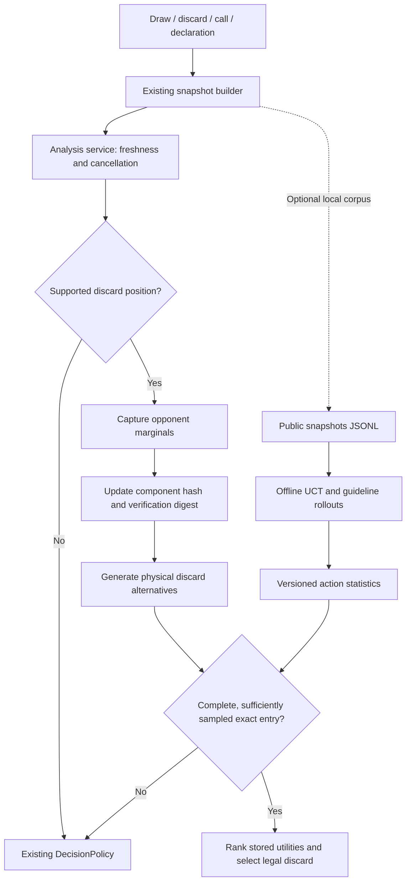

# Precomputed belief-state policy experiment

For complete four-player self-play, information-set MCTS, resumable parallel
generation and the portable Windows package, see [the simulator guide](SIMULATOR.md).
The commands below document the earlier short-horizon discard prototype.

The `experimental` branch now has a runnable first vertical slice: collect public
snapshots, train discard values offline, load a versioned table, and use those
values at runtime. Both plugin settings are off by default.

This is an infrastructure and simulator prototype, not a trained replacement for
the whole policy. Its playing strength has not been measured. It supports healthy,
verified **closed hands on an ordinary draw with only discard legal**. Calls,
riichi, wins, open hands, incomplete observations and missing table entries use the
existing `DecisionPolicy`.

## Try the standalone pipeline

Requires the .NET 10 SDK; the offline tool has no Dalamud or game dependency.
Run from the repository root, using an unused path for the example file:

```powershell
dotnet run --project tools/Precompute -c Release -- example snapshots.jsonl
dotnet run --project tools/Precompute -c Release -- train snapshots.jsonl precomputed_policy.json 2048 3 42
dotnet run --project tools/Precompute -c Release -- probe snapshots.jsonl precomputed_policy.json
```

The training arguments after the output path are iterations per state, horizon in
our discard decisions, and seed. Defaults are 2048, 3 and 1. Minimum budget is 112
iterations, horizon is 1–16, and Ctrl+C cancels without publishing partial results.
`example` refuses to overwrite an existing file. `train` atomically replaces its
output after training and validation succeed. The example is illustrative data,
not a representative training set.

`probe` prints the selected action and whether lookup succeeded or the original
policy supplied the answer. It does not perform MCTS. Duplicate input states are
trained once, ignoring snapshot sequence numbers and hand ordering.

## Collect real situations and load an artifact

1. Enable **Record situations for offline training**, save settings and reload the
   plugin. Supported decision snapshots are appended locally to
   `pluginConfigs/MahjongHater/precomputed_snapshots.jsonl`. Recording can run with
   the existing policy. It includes our tiles and public table information, with
   no player names or hidden opponent hands. A write failure stops recording for
   that plugin session and logs the error; advice continues.
2. Train that JSONL file with the standalone command above. Each line is a complete
   `StateSnapshot`; `SnapshotJson` is the round-trip serializer. Tiles use `1m`,
   `0p`, `7z` notation. The trainer rejects inconsistent visible tile counts; `train`
   reports those rows and trains the rest, so one bad row does not cost a whole session's
   recording. (8 of the 79 rows recorded on 2026-09-22 carried a fifth visible copy of a
   tile — a state-tracking defect worth chasing separately.)
3. Place the output at
   `pluginConfigs/MahjongHater/precomputed_policy.json`, or ship it with the plugin by
   putting it in `resources/policy/` before building: the plugin looks in the config
   folder first, then next to the DLL, then in `resources/policy`, and reads a
   `precomputed_policy.json.gz` directly.

   **What a table is and is not.** Entries are keyed by an exact belief-state identity —
   ordered discards, scores, wall, beliefs and all. A table therefore answers the states it
   was trained on and nothing else; it is a cache of solved positions, not a model that
   generalises. The trained *model* in this plugin is the learned policy in
   `resources/models`. Expect a table trained on a recorded session to hit ~never in new
   play, and see [the simulator guide](SIMULATOR.md) ("Exact matches from random self-play
   will be rare") before spending days of CPU on a large one.
4. Enable **Experimental precomputed policy**, save and reload. The plugin logs
   the loaded state count, or the reason it could not load the table. The overlay
   shows the lookup/fallback reason with each decision.

The CLI currently uses `PolicyWeights.Default` (Defense V2). Loading requires the
same weights as the plugin; disable neither Defense V2 nor change its weights
without retraining with a matching trainer configuration. Ruleset and belief
values are also part of each entry's identity.

## Runtime and offline responsibilities



- `Core/Precomputed/BeliefState.cs`: capture per-opponent tenpai probability,
  expected hand value and conditional danger for every tile kind. This reuses
  `OpponentModel`; it is a marginal belief summary, not a full hidden-hand posterior.
  Runtime workers own separate model instances.
- `IncrementalStateKey`: canonical, deterministic identity. Component changes XOR
  out the old digest and XOR in the replacement; an independent full canonical
  digest verifies retrieval. Includes red tiles, meld types/openness, ordered
  discards and global discard chronology, riichi information, visible indicators,
  scores, winds, round, wall, rules, legal actions, state health, beliefs and policy
  profile. Hand order, local sequence, raw game codes and translated labels are
  excluded. Resetting/rebuilding or visiting snapshots out of sequence produces
  the same identity. Serialization and the verification digest still scan the
  snapshot: this is component-level incremental hashing, not O(changed tiles)
  event processing.
- `AnalysisService` now uses the same canonical observation identity for freshness.
  Score, rules, round and discard chronology changes therefore trigger analysis
  and invalidate stale publications even when the hand has not changed.
- `DiscardActionSpace`: preserves red/plain alternatives. It intentionally defers
  all other action spaces until their complete legality can be represented,
  including kuikae and wait-preserving riichi kan restrictions.
- `PolicyTable`: validated JSON artifact, loaded once into an immutable
  `FrozenDictionary`. Records contain two identity digests plus per-discard visits,
  mean utility, sample variance, shanten, ukeire and waits. Schema, simulator and
  weight profile mismatches are rejected. Duplicate states/actions and invalid
  numeric statistics are rejected. Runtime requires all legal alternatives and at
  least eight visits for each. This floor is coverage protection, not a statistical
  guarantee that the chosen action is superior.
- `PrecomputedPolicy`: implements `IPolicy`. A hit ranks offline means, displays
  current model danger and returns `ActionChoice` without calling the hand analyzer
  or running search. Missing or incomplete coverage uses the existing policy. The
  action identity is checked against the current hand before returning it.
- `OfflineDiscardTrainer`: selection, expansion, guideline rollout and backup with
  a UCB score. The tree branches on our observed draws. Root alternatives get at
  least eight real samples, and returns/variance are accumulated for export. Only
  supplied root snapshots are exported; simulated future nodes are not mislabeled
  as observed game snapshots.

## What the first simulator means

The artifact's simulator ID is `closed-discard-proxy-v1`. Its returns are **proxy
point utility**, not calibrated full-game EV or match-placement utility:

- It samples our draws without replacement from tiles not visible at the root,
  preserving red copies and assuming one red five per suit. This is a marginal
  draw model; it does not construct three hidden hands and a dead wall.
- Each discard samples deal-in events using the root opponent marginals. Those
  beliefs remain fixed throughout the simulated horizon. Opponent turns consume
  three wall draws before our next draw, but do not reveal modeled discards,
  calls or new riichi declarations. Opponent wins against other players and
  opponent tsumo are not modeled.
- Completed self-draw hands use the existing yaku/fu/scoring code, with honba and
  riichi-stick gains. Double-wind pair fu is fixed at 4, as in the current core.
- At the horizon, existing `HandValue` guidelines estimate continuation from
  shanten, live improving tiles, dora and remaining wall. These estimates can
  assume value from future play the proxy does not explicitly simulate. At an
  exhausted wall it returns zero; noten payments are not modeled yet.
- Utilities are capped to ±48,000 points. Expansion/rollout prioritizes shanten,
  ukeire, modeled loss and preserving red fives. The UCB exploration term uses
  utilities divided by 48,000 to keep its scale bounded.

Eight samples per alternative and the example budget establish a functioning
pipeline; they do not establish adequate convergence. A fixed corpus, options,
weights and seed produce reproducible output on the same .NET implementation.

## Hash retrieval and coverage

Hash equality recognizes an identical encoded situation. The numerical difference
or Hamming distance between hashes does **not** tell us which mahjong position is
similar or which action comes next. Updating the hash makes lookup straightforward;
it does not replace legal action generation or utility comparison.

Exact full-state coverage will be extremely sparse in real matches. This first
version is useful for replay, regression and measuring the offline/runtime
boundary. A small representative corpus is unlikely to produce many live hits.
There is deliberately no approximate fallback masquerading as an exact match.

## Next implementation stages

1. **Full simulation and belief updates.** Add a testable four-player transition
   model, tile-conserving hidden-hand sampling conditioned on public history,
   chance events, calls, riichi/furiten/kan legality, exhaustive draws and match
   scoring. Evolve beliefs when simulated public observations arrive.
2. **Separate reusable hand knowledge from strategy.** Key structural hand
   evaluations independently of opponent history; use suit canonicalization where
   rules/dora preserve the symmetry. This can improve coverage before introducing
   approximate strategic retrieval.
3. **Versioned strategic abstraction.** Define meaningful features/buckets for
   turn, wall, shanten, ukeire, hand value, score needs and opponent threats. Store
   abstraction IDs and confidence alongside action values; always recheck legal
   actions and exact hand properties at runtime. Alternatively distill search
   targets into a model with legal-action masking.
4. **Representative corpora and evaluation.** Stratify captured states, hold out
   whole matches, track exact/abstract hit rates and fallback rate, compare action
   regret and latency, then compare point/placement results against the current
   policy. Increase training budgets based on convergence, not only raw visits.
5. **Scale storage after measuring it.** Retain the lookup interface, replace JSON
   with an indexed binary or memory-mapped artifact when corpus size warrants it,
   and benchmark load time, memory and lookup latency. Add provenance for the
   training corpus, trainer revision and evaluation results before distributing
   trained artifacts.

Tests in `MahjongHater.Tests/Policy/PrecomputedPolicyTests.cs` cover incremental
identity, relevant state changes, belief/profile separation, red alternatives,
table validation/round-trip, legal coverage/fallback, concurrent lookup,
cancellation, corpus serialization and deterministic offline-to-runtime use.
