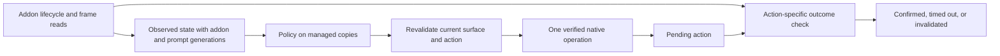

**Doman Mahjong UI interaction audit — 2026-09-23**

Audited `main` at `6e1a9f47fe07b356361b8960e171950db1d175c9`, version **2.3.0** from `Directory.Build.props`. The README's version and interaction description lag behind this implementation. This is a source and saved-capture audit; no actions were sent to a running game. Production code was not changed.

**Verdict: retain the reader/snapshot/policy separation and the use of measured native operations, but revise the interaction controller before treating it as reliable.** Using `FireCallback` is not inherently the wrong approach. Treating it as a universally complete command API, accepting any subsequent snapshot change as success, and identifying windows by presence or timing are the problematic assumptions. Several safeguards described in comments do not hold in the executable paths.

The most consequential evidence finding is that the saved timeline contradicts the claim used to justify bare discard callbacks: **all 100 discard callbacks have a matching `ButtonClick` in the same frame**, including the four described as event-free automatic discards. This does not prove a bare `[7, slot]` fails. It means the claimed proof of sufficiency is absent.

The external references below were inspected directly, including checked-out public source. Official Dalamud documentation establishes service and lifecycle contracts; public plugin implementations are examples, not a specification of the Emj protocol.

| Reference | Revision inspected | What it establishes |
|---|---|---|
| [Dalamud AddonLifecycle][lifecycle] and [event definitions][events] | Documentation retrieved 2026-09-23 | Named addon lifecycle observation, setup versus visibility versus destruction. |
| [Dalamud IFramework][framework] | Documentation retrieved 2026-09-23 | Framework-thread scheduling and blocking/deadlock cautions. |
| [Dalamud AddonEventManager][eventmanager] | Documentation retrieved 2026-09-23 | Managed registration of custom node events; this is not a universal action-dispatch service. |
| [FFXIVClientStructs AtkUnitBase][unit], [AtkComponentList][list], [AtkComponentBase][component], [AtkEventData][eventdata] | `313161e448e335adddd928f8a0212b2c328b5659` | Actual bindings, readiness, component type checking, list selection and event payload layouts. |
| [ECommons Callback][callback], [ClickHelper][clickhelper], [addon readiness helpers][ready] | `f1656e8885eff98d331dcb3136ae8af4d05edfb2` | Both callback and event routes exist in established community tooling. |
| [YesAlready dialog handling][yesno], [base feature][textfeature], [list handling][selectstring] | `4904e89042edf8a666a81b91c02d461f56fe7989` | Context/text matching, readiness, and lifecycle-based interaction. |
| [FFXIV-AutoMahjongSolver dispatcher][solver], [slot reader][solverreader], [addon resolver][solveraddon] | `21ae5ca9aa1fa3785baa540245b51efa346f9d37` | A directly comparable Mahjong implementation, including its own workarounds and uncertainty. |
| [AntiAfkKick][antiafk] | `92a196ebc4c9f478f0f46ada9da251e98f13d37b` | A separate OS-input approach for idle activity. |

Public source revisions need not match the installed client ABI. The local validation build used Dalamud DLL file version `15.0.3.5` and FFXIVClientStructs DLL file version `7.56.2.9089`. Availability and semantics of proposed bindings must be checked against the supported local version before implementation.

**Side-by-side comparison**

| Concern | Dalamud / community implementation | Current MahjongHater | Assessment |
|---|---|---|---|
| UI observation | Named lifecycle listeners avoid individual addon hooks. [Dalamud][lifecycle] | `PostRefresh` and `PostReceiveEvent`, then managed copies and snapshots. | Good foundation. Add lifetime invalidation. |
| Threading | Framework service provides the main-thread execution boundary. [Dalamud][framework] | Reader and actuator run in `Framework.Update`; analysis consumes managed state off-thread. | Keep this separation. |
| Readiness | Explicit ready/load checks exist. [FFXIVClientStructs][unit], [ECommons][ready] | Most accessors require only a non-null addon and root; some also require visibility. | Existence is insufficient for action readiness. |
| Action transport | Typed callbacks and targeted event delivery both occur. [ECommons callbacks][callback], [click helpers][clickhelper] | Main actions now use callbacks; some buttons still use registered events. | A hybrid is reasonable if each route has evidence. |
| Discard protocol | The public solver sends `[15, rawTile]` then `[7, slot]` in selected states. [Dispatcher][solver] | Sends `[7, slot]`; deliberately excludes `[15]`. | Protocol disagreement requiring controlled validation. |
| Call-list activation | The solver chooses `[11, option]` or `SelectItem(..., true)` depending on popup form. [Dispatcher][solver] | `AnswerCall` always sends `[11, row]`. | One route has not been established for every surface. |
| Slot identity | The solver resolves the original raw hand-array slot. [Reader][solverreader] | Derives the callback argument from a filtered, X-sorted visual-node list. | Preserve raw slot identity independently of rendering. |
| List safety | Bindings expose component type and list disabled state. [Component][component], [list][list] | A broad component-node check precedes a list cast; enabled checks use permissive OR. | Unsafe assumptions remain. |
| Shared dialogs | YesAlready matches configured text/context; its party-finder case checks the dialog's addon ID against its owning agent. [Source][yesno] | Any suitable Yes/No within six seconds of a result-close attempt can be answered. | Timing is not ownership. |
| Window lifetime | Setup, show/hide, close, and finalize are distinct events. [Definitions][events] | Match presence follows `Emj` existence; no setup/finalize listener owns the session. | Introduce an addon/session generation. |
| Plugin windows | `WindowSystem` renders registered ImGui windows; it does not own native addons. [Dalamud][windows] | Main/config windows use `WindowSystem`; the tile glow uses a foreground draw list. | Appropriate. Native windows need separate lifecycle logic. |
| Idle activity | AntiAfkKick sends Control down/up through OS messages. [Source][antiafk] | `IdleGuard` does similar work with timer observation and release tracking. | Separate from addon action correctness and mouse hit-testing. |

The public solver is useful evidence but should not be copied wholesale. Its dispatcher contains fallback routes and inconsistent historical comments, including conflicting descriptions of post-call list behavior. It also hardcodes some pass/accept positions. MahjongHater's live-row resolution, ambiguity rejection, and prompt-generation guard are useful protections to retain.

**1. High priority: the discard-validation rationale is contradicted by the capture.**

Local references: `Core/Operate/EmjOperator.cs:351`, `Core/Operate/EmjProtocol.cs:19`, and [the protocol research note](ADDON_PROTOCOL_2026_09_23.md).

The implementation argues that the game emits `[7, slot]` without a preceding button event during riichi, therefore the bare callback is complete. The research note identifies four timestamps. In `artifacts/capture/timeline.json`, each has an `Emj` `ButtonClick`, with `param == slot + 15`, in the same frame:

| Callback UTC | Frame | Slot | Matching event UTC | Event sequence |
|---|---:|---:|---|---:|
| 05:36:04.8419588 | 95423 | 13 | 05:36:04.8420099 | 4188 |
| 05:36:20.2579840 | 96348 | 13 | 05:36:20.2580311 | 4285 |
| 05:37:19.8059571 | 99921 | 3 | 05:37:19.8060069 | 4561 |
| 05:37:56.5879954 | 102128 | 9 | 05:37:56.5880189 | 4776 |

These pairs cross a millisecond boundary despite being only approximately 24–51 microseconds apart. Pairing by a truncated millisecond would miss them. Frame plus event type plus slot parameter matches **100/100** discard callbacks. The exact earlier analysis implementation was not available, so millisecond bucketing is a likely explanation, not a proven history of the mistake.

A callback appearing before a post-event log also does not establish that no event caused it: the callback can run inside the native event handler, before the post-event listener logs the return.

The public solver takes the opposite position on `[15]` in its supported states. Neither a mouse-hover sequence in a manual capture nor these event pairs settle which operations are necessary for every game state. Corrective action: remove the unsupported proof, and compare independently verified outcomes for bare callback, paired callback, and known working manual activation. Do not add or ban `[15]` solely from correlation with a freeze.

**2. High priority: dispatch can manufacture its own acknowledgement. Confirmed code behavior.**

Local references: `EmjActuator.AnswerCall` at line 104, `EventTracker.MarkCallAnswered` at line 158, `SnapshotBuilder.Build` at line 103, and `AutoPlayer.Tick` at line 141.

The current sequence is:

1. Send `[11, row]`.
2. Immediately call `MarkCallAnswered` without observing a game outcome.
3. Clear the tracked prompt, suppress a matching echo, and optionally set `WinDeclared`.
4. Build a new snapshot from those changed local fields.
5. Treat a changed snapshot sequence as the previous action being accepted.

For a win, setting `WinDeclared` even forces the derived phase to `RoundEnd`. Thus an ignored dispatch can produce an apparent phase change and be reported as successful. Unrelated changes, such as another seat's state or a health note, can also advance `Sequence`.

The generation check correctly protects a newer prompt opened synchronously during dispatch. It does not prove acceptance of the old one. Existing tracker tests deliberately assert the immediate clear, so their success does not cover this failure mode.

Keep **pending intent** separate from **observed game state**. A pending win can temporarily suppress unsafe discards without declaring that the round ended. Confirm a discard through our discard event and corresponding hand change; confirm a meld through its actual tiles/count; confirm riichi through declaration state; confirm recap progression through the expected surface/state transition. Retrying or clearing must depend on that action's outcome.

**3. High priority: stale or unhealthy observations remain actionable. Confirmed missing guard.**

Local references: `EmjStateReader.Tick:98`, `SnapshotBuilder.Build:41`, `AnalysisService.IsAnalyzable:68`, `AutoPlayer.ActOnDecision:187`.

On read failure the reader explicitly retains its last snapshot and decoded hand. On a decode-health failure the builder can retain the last healthy hand. The overlay warns about `LayoutHealthy`, but the analysis eligibility and auto-play path do not reject it. A decision fingerprint matching an old retained snapshot proves consistency with that snapshot, not with current game memory.

The chi-choice path illustrates the missing final gate: `ClickChiShape` matches an offered shape from the supplied snapshot, then sends `[12, index]` without verifying the current chooser button's visibility/enabled state. `FireCommand` itself checks neither readiness nor visibility. A still-loaded addon with a root is sufficient at that boundary.

Separate display fallback from action eligibility. Preserve stale advice visibly if useful, but stop hand-dependent actions after failed reads, an expired observation, or an unvalidated layout. Define exceptions narrowly: accepting an independently verified live win offer need not depend on a perfect hand reconstruction. Add read time/frame and addon generation to the action contract.

**4. High priority: list reads do not prove the component is a list. Confirmed unsafe cast.**

Local references: `EmjOperator.Rows:124`, `SelectRow:291`, and `IsRowEnabled:451`.

`node->Type >= 1000` only establishes a component node. `Rows` then casts its component to `AtkComponentList` and reads list-specific fields. A changed node path, layout mismatch, or different popup component can make those fields unrelated memory. This is in the normal callback path because `AnswerCall` still calls `Rows` before dispatching.

Use a verified list component type before the cast; upstream exposes `GetComponentType`. Validate counts, table pointers, renderer owners, and bounds before dereferencing. Do not treat a ULD-specific numeric node type from another plugin as a universal component classifier. [FFXIVClientStructs component binding][component]

The enabled predicate is also weaker than its callers claim:

```csharp
!list->GetItemDisabledState(index) || renderer->AtkComponentButton.IsEnabled
```

It accepts disagreement in either direction. Its comment assumes a false enabled result merely causes the game to ignore a click. That assumption is particularly weak now that the caller bypasses the widget and directly issues a callback. Resolve which field is authoritative from observations; until then, refuse conflicting state. `SelectRow` itself does not recheck enabled state either. [Disabled-state and selection bindings][list]

**5. High priority: shared-window ownership is insufficient. Confirmed conditions; harmful occurrence not reproduced.**

Local references: `EmjActuator.ConfirmYesNo:338`, `MatchQueuer.Tick:145`, `ClickJoin:251`, `HideFinder:273`, `Commence:280`.

The Yes/No guard checks elapsed time after a result close, not prompt identity, creator, addon generation, or whether the dialog already existed. A unrelated dialog encountered within that six-second window can be accepted. The NPC capture contains no end-of-match Yes/No requiring this route.

Remove this speculative confirmation path until a real end-flow dialog is measured, or require a specifically identified dialog with a matching owner/context and pending transaction. YesAlready provides concrete examples of text restrictions and agent-associated dialog IDs; elapsed time is only an additional constraint. [Dialog implementation][yesno]

Queue handling has the same ownership issue. With requeue enabled, any `ContentsFinderQueueState.Ready` reaches `Commence`; it need not be a Mahjong duty requested by this controller. While using the window route, `ClickJoin` does not revalidate the selected duty after the player can change it. `HideFinder` hides any active finder agent, without remembering whether this controller opened that instance. Also, `Commence` falls back to callback `8` when the typed button is disabled, bypassing the stronger guard.

Track the requested duty and queue transaction, verify the ready content identity, and remember which window instance the plugin opened. Cancel pending interaction on user changes or incompatible state. A missing binding can justify a separately validated fallback; an explicitly disabled control should cause a wait/refusal, not a stronger dispatch.

**6. Medium priority: the callback slot is derived from visual order. Confirmed conflation; wrong live discard not reproduced.**

Local references: `EmjActuator.DiscardTile:166`, `EmjScanner.ScanHandSlots:29`, `EmjStateReader.FindSlotNodeForTile:428`.

The scanner filters invisible nodes, excludes parked positions, deduplicates near-identical X coordinates, and sorts visually. The actuator then uses `slots.FindIndex(target)` as the native slot argument. Filtering or compacting any earlier slot changes that number. Recognizing the draw node by ID does not preserve its callback identity when its position in the filtered list changes.

Carry the original struct-array slot through tile decoding and decision resolution, keeping slot 13 as slot 13. Use node geometry only for highlighting and readiness checks. Where captured event wiring provides `param = slot + 15`, use it as a consistency check against the struct slot, not as an assumption inferred from visual position. The public solver's reader already separates raw addon slots from display indices. [Slot resolver][solverreader]

**7. Medium priority: the native-list comparison toggle does not test the main call path. Confirmed dead configuration path.**

Local references: `Plugin.OnFrameworkUpdate:388`, `Windows/MainWindow.cs:297`, `EmjOperator.SelectRow:291`, `EmjActuator.AnswerCall:132`.

The UI says calls can use native list selection. The plugin sets `EmjOperator.Route`, but `AnswerCall` now always invokes `FireCommand`. Only `SelectRow` reads `Route`, and normal call answers no longer reach it. An apparent A/B session using this toggle is not comparing the two main transports.

Either remove the setting and misleading diagnostics, or connect a deliberate experimental route at the actual dispatch boundary. Record the route actually executed, addon/prompt generation, arguments, and observed outcome for every trial.

**8. Medium priority: addon lifetime and match lifetime are not explicitly managed. Confirmed design gap.**

Local references: `EmjStateReader` constructor at line 43 and `Tick:84`, `EmjActuator.IsAddonOpen:78`, `AutoPlayer.Tick:125`.

The reader subscribes to refresh and receive-event, but not setup/finalize. A missing addon clears snapshots and the builder, yet does not reset all event-tracker session state. Round-reset heuristics can repair normal transitions, but are not a lifecycle guarantee. Reacquiring pointers each tick is good and avoids a persistent cached-addon-pointer defect; this is instead about stale logical state and incomplete readiness.

Maintain an addon generation from setup/finalize, bootstrap an already-open addon on plugin load, and invalidate pending actions on destruction/replacement. Treat hide separately from destruction: `Emj` being hidden during `EmjTotalResult` is a legitimate result flow. Do not reset the entire match merely because visibility changed. Dalamud explicitly distinguishes these events. [Lifecycle definitions][events]

**9. Medium priority: generic event fallback can cross a native mutation boundary with old pointers. Conditional crash risk.**

Local references: `EmjOperator.ClickNode:276`, `HoverAndRelease:404`, `FindChainEventInSubtree:518`.

The down/up path resolves both event pointers, dispatches down, then dereferences the old up pointer. Hover similarly resolves both pointers before dispatching over. If the first handler rebuilds/finalizes relevant nodes, copying scalar fields inside the second `FireChain` is already too late. This contradicts the class-level claim that pointers are not revisited after dispatch.

These are secondary paths, not the current main discard callback route. Remove unnecessary multi-event fallbacks or reacquire targets against a still-valid addon generation after each native call. Never assume same-thread execution prevents synchronous native reentrancy.

The generic event search also falls back from visible addon-bound targets to hidden or other-listener targets, and validates the outer node rather than every selected holder's ancestry. That is broader than the advertised refusal rules. Prefer a specific verified control adapter to a generic search for something that accepts an event.

**10. Medium priority: result addons need individual adapters and independent servicing.**

Local references: `EmjActuator.AdvanceRecap:239`, `CloseResultScreen:432`, `MatchOverAddons:63`.

The capture directly supports `EmjTotalResult` node 26 / button parameter 0. Resolving a dedicated result addon is a real improvement over searching the table's pooled text for an English caption.

However, the code applies the same close-node ID to `EmjRankResult`. The inspected rank capture is empty and its tree dump reports that the addon was not loaded; it does not validate this assumption. The result handler also cannot run after `GetAddon(Emj)` returns null, and the auto-player stops when `IsAddonOpen` becomes false. Whether ranked results can outlive that table instance must be tested.

Service result surfaces independently of the table pointer, with a separately verified adapter for each addon. Wait for the expected disappearance/next result before moving to requeue. Do not replace a native result-button action with arbitrary `[-1]`/`[-2]` callbacks merely because those appear downstream in its trace.

**11. Medium priority: English labels and unsupported variants need an explicit boundary.**

Local references: `CallRowResolver.Normalize/Resolve`, `EventTracker.OpenCallWindow`, `EmjStateReader.ScanWinds`, `resources/layouts/emj.json`.

The resolver matches semantic actions to English row text. Winds and other state hints also use English strings. This can refuse valid actions or misread state on other client languages. A single named layout is not evidence for all addon variants. The public solver probes both `Emj` and `EmjL`, but its regional claims should be independently checked. [Resolver][solveraddon]

Prefer verified option codes and structural slot identities. Where localized text is necessary, use supported client-language data and declare the validated language/layout combinations. Unknown layouts should disable affected automation rather than inherit untested offsets.

**12. Lower priority: the highlight and diagnostics can imply more certainty than they provide.**

Local references: `Windows/MainWindow.DrawBestDiscardHighlight:602`, `UiInputReport.Build`, `EmjOperator.FireCallback:381`.

The highlight is drawn through ImGui's foreground draw list; it does not create a full-screen input-catching window or modify native focus. There is no evidence in that code that the glow itself blocks mouse input. It should still require the addon's visibility and the target's ancestor visibility so hidden tables do not leave a floating highlight.

Input diagnostics are useful observations, but an empty focus list does not alone prove an input deadlock, and a null collision intersection does not prove all hit-testing is broken. Capture pointer coordinates, expected tile bounds, collision state, modal ownership and ImGui capture on the same frame. Interpret them as evidence, not a diagnosis embedded in a log string.

The callback wrapper names its third argument `updateState`; the inspected upstream binding calls it `close`. That naming discrepancy is not proof that passing `true` is wrong: the local captures record `true` for the main actions. Preserve measured values per operation and avoid deriving universal semantics from either name. The raw overload defaults to `false`, despite comments describing a true default; `FireCommand` explicitly supplies `true`. [Upstream signature][unit]

**What the saved evidence actually establishes**

| Claim | Evidence available here | Conclusion |
|---|---|---|
| Discards emit `[7, slot]` | 100 timeline callbacks, all paired to matching button events in the same frame. | Payload observed; bare-callback sufficiency not established. |
| Four discards had no button event | The four exact timestamps have matching events, shown above. | The research/code claim is contradicted. |
| Call rows emit `[11, row]` | The current saved timeline has 28 records; `cb_Emj.json` has 28 records / 30 fires including repeats. | Transport observed; the prose count of 22 is not the count of this saved artifact. |
| Recap Next emits `[14]` | Ten callbacks in the current timeline. | Supported; the prose count of nine is stale or uses a different subset. |
| Chi choice emits `[12, 0]` | `cb_chooser.json`, 06:28:26.5301297Z, frame 283302, flag true; chooser tree shows button 5 / parameter 9. | One choice is directly captured. All chooser branches still need outcome coverage. |
| End match is `EmjTotalResult` node 26 | Timeline sequence 6177, 05:43:03.2032667Z; surrounding result lifecycle and callbacks. | Supported for the recorded NPC flow. |
| The same node closes `EmjRankResult` | Rank callback capture empty; tree dump says not loaded. | Unvalidated in the inspected artifacts. |
| End match needs a Yes/No | No such dialog in the recorded end sequence. | Current speculative handling has no support from this capture. |
| Missing `[15]` caused the dead mouse | Local stuck-UI note reports onset after a manual discard while auto play was off. | Cause remains unresolved; prior plugin effects are possible but unproven. |

Audit fingerprints for the saved captures:

```text
timeline.json          DB480CA9CEBF291315D9B7BF268BE135335137C4414AFD4918FCFD33745EF5B0
cb_Emj.json            1711E8ABB1CA8576B67ECD6BD89F5E5601862FEFE4226E89CB84ECDFE7F9160C
cb_EmjTotalResult.json 5DA2D69083B3D4FC413ACDBC4E611AB5D002CFF68DDA08D2A73A589B08C72A49
```

The distinction between source facts, captured correlations, and tested postconditions should be preserved in future research notes. “Observed during a successful human action” is a useful starting point, not proof that replaying that one operation reproduces the entire action.

**Recommended window/action model**

Keep the current pure policy boundary. Replace implicit window assumptions with explicit ownership and state:



For each action, resolve the addon again on the framework thread, require an initialized and appropriate visible surface, confirm its session/prompt identity, verify the semantic target and enabled state, issue one validated operation, then await a specific observed outcome. If the native operation can synchronously mutate the UI, consume no previous node/event pointer afterward.

Use separate controllers/adapters for the table, chi chooser, round recap, total result, rank result, and queue. A hidden-but-alive table can coexist with results. A loaded shared dialog is not automatically owned by this plugin. Native `Hide`, `Close`, and a button whose handler triggers gameplay completion are different operations; choose the one verified for that particular surface rather than trying to repair focus generically. [Native window bindings][unit]

`AddonEventManager` is appropriate if adding new interactive native nodes and wanting their registrations cleaned up. It does not replace the above controller or certify that an arbitrary synthetic click follows every side effect of real input. [Service documentation][eventmanager]

`IdleGuard` must remain a separate concern. Its release bookkeeping is more cautious than a blind key press, but a Control press also affects Mahjong's own UI. Successful addon callbacks do not demonstrate healthy OS input, and healthy idle timers do not demonstrate correct mouse routing. Isolate idle nudges when diagnosing the input freeze. [Public idle-input example][antiafk]

**Order of work and validation**

1. Correct the capture interpretation and remove dead comparison controls. Record actual dispatch routes and outcomes so subsequent experiments measure what they claim.
2. Separate pending actions from observed state; stop accepting arbitrary sequence changes as acknowledgement. Add freshness, health, and addon-generation gates.
3. Fix list type validation and conflicting enabled-state handling. Remove speculative Yes/No acceptance and bind queue actions to the requested Mahjong duty.
4. Preserve raw hand-slot identity. Add individual result adapters and setup/finalize invalidation, while retaining hide/show state through the result flow.
5. Compare callback and native-widget routes in a controlled NPC session before expanding the supported matrix. Do not infer one required transport across all popups.

| Validation case | Required evidence |
|---|---|
| Normal discard, red/plain duplicate tile, post-pon/chi discard, riichi-locked discard | Requested raw slot and tile match our observed discard; actual hand changes accordingly. |
| Pon, Chi, Kan, Riichi, Tsumo, Ron, Pass | Correct offer generation and live target; matching semantic outcome, not only a changed snapshot. |
| Chi with multiple choices and cancellation | Each shape index yields that meld; cancellation returns to the observed preceding surface. |
| A dispatch that is ignored | Remains pending or times out; no fabricated win/closed prompt or accepted status. |
| Unrelated refresh after dispatch | Does not acknowledge the action. |
| Same-looking prompt immediately follows another | Old pending action cannot clear or answer the new generation. |
| Read failure, unhealthy hand, addon close/reopen, plugin reload mid-prompt | No stale dispatch; pointers and pending operations are invalidated or explicitly bootstrapped. |
| Shared dialog appears near result close; user changes Duty Finder selection | Plugin refuses unowned dialog/duty and preserves user-owned windows. |
| NPC result and ranked total/rank sequence | Correct addon handled at every stage, including any period after `Emj` destruction. |
| Manual mouse use before, during and after automation | Same-frame pointer, bounds, collision, focus, modal and ImGui-capture evidence; repeat with idle nudges isolated. |

Deterministic tests should cover the controller and ownership rules above; pure fixtures cannot establish native side effects. Existing validation: the Release build succeeded and **520 tests passed, zero failed/skipped**. Output was redirected to a temporary directory to avoid the normal dev-plugin output path. The first isolated test run lacked ancestor-relative fixture directories; after copying the existing fixtures and golden data into the isolated test tree, the unchanged suite passed. No live game validation was performed.

[lifecycle]: https://dalamud.dev/plugin-development/how-tos/AddonLifecycle/
[events]: https://dalamud.dev/api/Dalamud.Game.Addon.Lifecycle/Enums/AddonEvent/
[framework]: https://dalamud.dev/api/Dalamud.Plugin.Services/Interfaces/IFramework/
[eventmanager]: https://dalamud.dev/plugin-development/how-tos/AddonEventManager/
[windows]: https://dalamud.dev/api/Dalamud.Interface.Windowing/Interfaces/IWindowSystem/
[unit]: https://github.com/aers/FFXIVClientStructs/blob/313161e448e335adddd928f8a0212b2c328b5659/FFXIVClientStructs/FFXIV/Component/GUI/AtkUnitBase.cs
[list]: https://github.com/aers/FFXIVClientStructs/blob/313161e448e335adddd928f8a0212b2c328b5659/FFXIVClientStructs/FFXIV/Component/GUI/AtkComponentList.cs
[component]: https://github.com/aers/FFXIVClientStructs/blob/313161e448e335adddd928f8a0212b2c328b5659/FFXIVClientStructs/FFXIV/Component/GUI/AtkComponentBase.cs
[eventdata]: https://github.com/aers/FFXIVClientStructs/blob/313161e448e335adddd928f8a0212b2c328b5659/FFXIVClientStructs/FFXIV/Component/GUI/AtkEventData.cs
[callback]: https://github.com/NightmareXIV/ECommons/blob/f1656e8885eff98d331dcb3136ae8af4d05edfb2/ECommons/Automation/Callback.cs
[clickhelper]: https://github.com/NightmareXIV/ECommons/blob/f1656e8885eff98d331dcb3136ae8af4d05edfb2/ECommons/Automation/UIInput/ClickHelper.cs
[ready]: https://github.com/NightmareXIV/ECommons/blob/f1656e8885eff98d331dcb3136ae8af4d05edfb2/ECommons/GenericHelpers/AddonHelpers.cs
[yesno]: https://github.com/PunishXIV/YesAlready/blob/4904e89042edf8a666a81b91c02d461f56fe7989/YesAlready/Features/SelectYesNo.cs
[textfeature]: https://github.com/PunishXIV/YesAlready/blob/4904e89042edf8a666a81b91c02d461f56fe7989/YesAlready/BaseFeatures/TextMatchingFeature.cs
[selectstring]: https://github.com/PunishXIV/YesAlready/blob/4904e89042edf8a666a81b91c02d461f56fe7989/YesAlready/Features/SelectString.cs
[solver]: https://github.com/XeldarAlz/FFXIV-AutoMahjongSolver/blob/21ae5ca9aa1fa3785baa540245b51efa346f9d37/Mahjong.Plugin.Dalamud/Actions/InputDispatcher.cs
[solverreader]: https://github.com/XeldarAlz/FFXIV-AutoMahjongSolver/blob/21ae5ca9aa1fa3785baa540245b51efa346f9d37/Mahjong.Plugin.Dalamud/GameState/AddonEmjReader.cs
[solveraddon]: https://github.com/XeldarAlz/FFXIV-AutoMahjongSolver/blob/21ae5ca9aa1fa3785baa540245b51efa346f9d37/Mahjong.Plugin.Dalamud/GameState/MahjongAddon.cs
[antiafk]: https://github.com/NightmareXIV/AntiAfkKick/blob/92a196ebc4c9f478f0f46ada9da251e98f13d37b/AntiAfkKick-Dalamud/AntiAfkKick.cs
