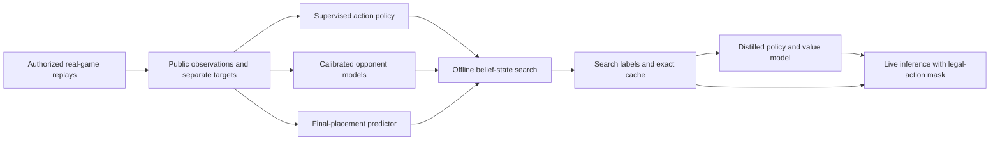

# Applying published Mahjong AI methods

Reviewed 2026-09-21. These are published methods and a proposed architecture for
MahjongHater, not a claim to reproduce proprietary current engines or their rank.

## What the primary sources establish

| System | Published approach | What transfers to this project |
|---|---|---|
| Bakuuchi lineage | Learn opponent readiness, winning tiles and winning scores from expert logs; use the predictions in Monte Carlo evaluation. | Calibrate our opponent models before spending substantially more search on their assumptions. |
| NAGA, published 2019 design | Four CNNs for discards, calls, riichi and kans, trained on Phoenix-table logs; decisions largely use network outputs. | Learn a policy that generalizes beyond exact hashes and includes defensive human choices. |
| Suphx | Supervised initialization followed by reinforcement learning, with a predictor connecting individual rounds to final-game rewards. | Learn match-placement value separately from hand point value. |

Sources: [Mizukami and Tsuruoka's 2015 paper](https://www.logos.ic.i.u-tokyo.ac.jp/~tsuruoka/papers/cig2015mizukami.pdf),
[Dwango's NAGA technical article](https://dmv.nico/ja/articles/mahjong_ai_naga/),
[Suphx paper](https://arxiv.org/html/2003.13590v2).

The NAGA article reports eighth dan at publication; a later
[2024 Dwango presentation](https://www.nii.ac.jp/dsc/idr/userforum/poster/IDR-UF2024_Dwango.pdf)
reports tenth dan. Bakuuchi's [publisher reports ninth dan](https://book.mynavi.jp/bakuuchi/).
These are Tenhou platform ranks, not equivalent tournament placings. The earlier
Bakuuchi research paper evaluates an earlier system, not the later ninth-dan
commercial version. Results also depend on opponent pool and ranking incentives.

## Proposed architecture

This keeps the original low-latency runtime objective: lookup and model inference,
with expensive simulations offline. Hashes index cached results; they do not
measure similarity or replace a generalizing policy. This combination is our
design recommendation, not an architecture claimed by all three source systems.

1. **Establish a held-out baseline.** Retain the existing simulator corpus. Import
   suitable real logs, filter by actor rank and source rules, deduplicate by game,
   and split by whole games. Measure current policy action agreement and opponent
   calibration before selecting models or larger generation budgets.
2. **Train opponent estimates and imitation together.** Predict tenpai probability,
   tile-specific legal ron risk and loss conditional on ron. Train discard/riichi
   choices from the actor's public/own observations. Realized win/loss is a noisy
   training target, not evidence that a human move was optimal.
3. **Add match utility.** Learn a placement distribution from public round/score
   context. Evaluate under Doman's objective, instead of blindly transferring
   Tenhou's fourth-place penalties. Our current hand-end point search and optional
   rank-change term do not implement this predictor.
4. **Spend search on uncertainty.** Compare independent searches on fixed held-out
   positions. Allocate deeper searches where candidate values overlap or where
   the learned policy and search disagree. Include wider particle populations:
   repeatedly simulating a few hidden hands does not remove belief-model bias.
5. **Distill, then evaluate.** Fit a compact policy/value model to human choices and
   validated search targets, keeping their losses distinct. Compare complete-match
   placement, point return, deal-in loss and inference latency against fixed
   baselines using matched seeds and seat rotations. Report uncertainty and
   failures, not just action agreement or an unverified equivalent dan rank.

Start with CPU-friendly opponent calibration and a compact policy baseline on the
available boxes. Neural training speed needs a measured hardware benchmark; a
GPU has not been specified. Reproducing the resource-intensive Suphx training
setup is not a prerequisite to test these incremental improvements.

## Implemented foundation versus remaining work

The current importer exposes observed discard/riichi actions, legal actions,
opponent readiness/waits/ron-value targets and final placement in separate label
fields. It exports game-disjoint train/validation/test JSONL and feeds public
observations into resumable offline search. Existing self-play runs stay compatible.

Call/pass/kan choice training data, learned model fitting, model calibration,
placement-value integration, distillation and inference deployment remain to be
implemented and evaluated. No NAGA/Bakuuchi weights or analysis-service outputs
were copied. The small downloaded upstream fixtures are parser validation data,
not the high-rank authorized training corpus required for this plan.
